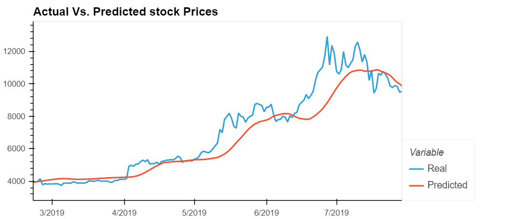
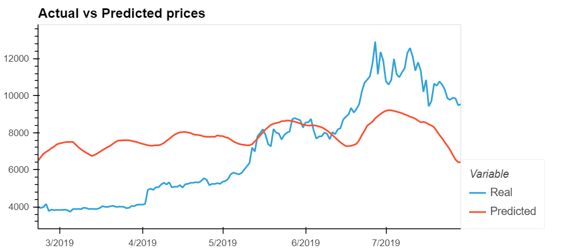

 # LSTM Stock Predictor

Due to the volatility of cryptocurrency speculation, investors will often try to incorporate sentiment from social media and news articles to help guide their trading strategies. One such indicator is the [Crypto Fear and Greed Index (FNG)](https://alternative.me/crypto/fear-and-greed-index/) which attempts to use a variety of data sources to produce a daily FNG value for cryptocurrency. You have been asked to help build and evaluate deep learning models using both the FNG values and simple closing prices to determine if the FNG indicator provides a better signal for cryptocurrencies than the normal closing price data.

- - - 

## HV Plot of the LSTM model with just the closing price

## HV Plot of the LSTM mode with closing prices and the Fear and Greed Index

- - - 

Use the above to answer the following:

> Which model has a lower loss?  

> - The LSTM model with just the closing price has a lower loss of 1.3% while the LSTM model with the Fear and Greed Index and closing prices has a loss of 8.8%
  

> Which model tracks the actual values better over time?

> - From the Images above we can see that LSTM model with closing prices tracks the values closely over time.

> Which window size works best for the model?

> - From my experimentation, I found a window size of 15 works best with the LSTM closing price model

- - -

